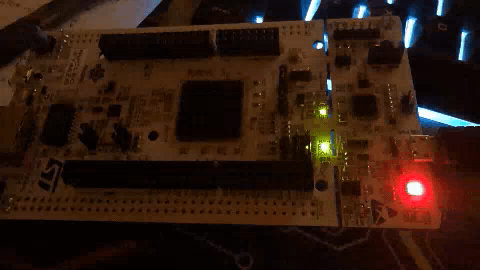
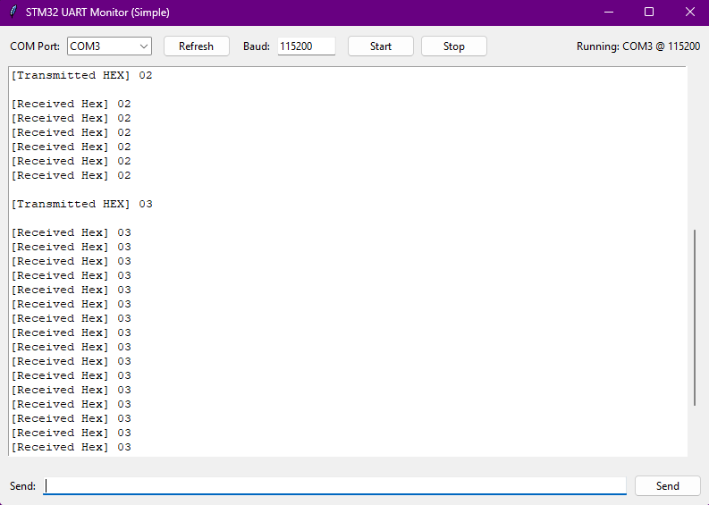

# End-to-End UART Test (PC GUI ↔ STM32)




# STM32F746ZG UART System-Mode Test + Python UART Monitor (HEX)

This repo contains:
1) A small **STM32F746ZG firmware test** to validate a simple **system_mode** concept via UART commands.
2) A lightweight **Python (Tkinter) UART Monitor** to send/receive **HEX payloads** (CAN-style habit) and log TX/RX in HEX.

---

## 1) Python UART Monitor (Tkinter GUI)

A Windows-friendly UART monitor to **send HEX payloads** and **view received bytes in HEX**.
Made for quick STM32 bring-up / “system mode” testing.:contentReference[oaicite:6]{index=6}

### Features
- ✅ GUI built with **Tkinter**
- ✅ Select **COM port** + set **baud rate**
- ✅ **Start / Stop** open/close serial port
- ✅ Send **HEX bytes** like CAN-style payloads
  - Accepts: `01 0A FF 00` or `010AFF00`
  - Also accepts `0x` prefix (it gets removed): `0x01 0x0A FF`
- ✅ Logs:
  - `[Transmitted HEX] ...`
  - `[Received Hex] ...`
- ✅ Non-blocking read (polls every ~50 ms)

### Requirements
- Python 3.x
- `pyserial`:contentReference[oaicite:10]{index=10}

Install:
```bash
pip install pyserial
````

### Run

**Option A — Run directly**

```bash
python python_project/monitor_uart_gui.py
```

(Your GUI defaults to 115200 baud.)

**Option B — Run using the batch launcher (Windows)**
Use `run_uart.bat` for one-click run with a venv Python:

1. Open `run_uart.bat`
2. Edit:

   * `VENV_DIR=...`  (your venv folder)
   * `SCRIPT_PATH=...` (full path to `monitor_uart_gui.py`)
3. Double-click `run_uart.bat`

### How to use

1. Click **Refresh**
2. Select your **COM port**
3. Enter **Baud** (default: `115200`)
4. Click **Start**
5. Type HEX in the Send box and press **Enter** or click **Send**

### HEX input examples (valid)

* `01`
* `01 0A FF 00`
* `010AFF00`
* `0x01, 0x0A, FF, 00`

**How HEX is handled internally**

* The GUI converts your input using Python `bytes.fromhex(...)` after removing `0x` and commas, then writes raw bytes to serial.
* TX log format:

  * `[Transmitted HEX] 01 0A FF ...`
* RX log format:

  * `[Received Hex] ...` (uppercase, space-separated)

---

## 2) Firmware logic: UART “system_mode” test (STM32F746ZG)

This firmware is a simple **mode test harness**:

* UART RX runs via interrupt (`HAL_UART_Receive_IT`) to continuously capture bytes.
* Every `CYCLE_TIME` (e.g., 1000 ms), the firmware reads the last received command byte and updates a basic mode/state:

  * `inactive_mode` → system off (LEDs off)
  * `work_mode` → execute action based on command byte

### Command bytes (example)

| Command (HEX) | Action                                  |
| ------------- | --------------------------------------- |
| `0x00`        | Toggle LED 1                            |
| `0x01`        | Toggle LED 2                            |
| `0x02`        | Toggle LED 3                            |
| other         | Set `inactive_mode` (turn OFF all LEDs) |

> Note: LED pin mapping depends on your board/project pin configuration.

### End-to-end test idea

* Send `00`, `01`, `02` from the Python GUI
* Observe LED toggle + optional UART echo back
* Send any other byte to verify the system goes inactive (LEDs OFF)

This is intentionally minimal and meant only to validate **mode switching + UART command handling**.

---

## 3) STM32F746ZG – Setup (Hardware + Tools)

This project uses ST’s official toolchain and workflow.

### Hardware / Board Documentation

* **STM32 Nucleo-144 boards (MB1137) – User Manual (UM1974)**
* **ST Wiki – Getting Started with STM32**
* **STM32F7 HAL & Low-Layer driver description (UM1905)**

### Required Applications

* **STM32CubeMX** (pin/clock config + code generation)
* **STM32CubeIDE** (build + debug)
* **STM32CubeProgrammer** (flash via ST-LINK/SWD)

### Typical workflow (quick)

1. Configure (CubeMX) → generate project
2. Build/Debug (CubeIDE) → produces `*.elf`
3. Flash (CubeProgrammer) → program & verify firmware

---

## 4) Troubleshooting (GUI)

**No COM port shown**

* Click **Refresh**
* Check USB-UART driver / ST-Link VCP driver
* Try another USB port/cable

**"Access denied" / cannot open port**

* Another program is using the COM port (close CubeIDE terminal, PuTTY, etc.)
* Unplug/replug device

**No received data**

* Check wiring: TX/RX swapped, common GND
* Confirm correct UART instance on STM32 and correct baud rate

---

## File overview (quick)

* `python_project/monitor_uart_gui.py` → Python Tkinter GUI UART monitor
* `run_uart.bat` → one-click runner using venv python (Windows)
* `images/uart_demo_light.gif` → lightweight demo GIF
* `images/GUI_ss.png` → GUI screenshot

